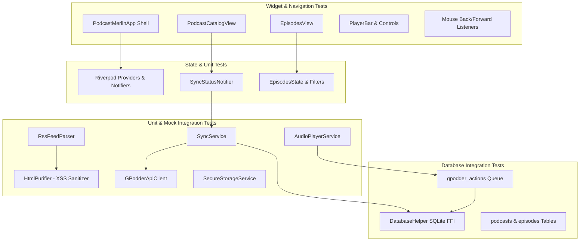

# Comprehensive Test Plan: Podcast Merlin (Flutter Nextcloud/gPodder Client)

> **Document Version**: 1.0.0  
> **Target Application**: Podcast Merlin Flutter (Windows / Desktop / Mobile)  
> **Scope**: Unit, Integration, Widget, Navigation, Security, and Sync Verification  

---

## 1. Executive Summary & Scope

Podcast Merlin is a Flutter application serving as a Nextcloud / gPodder podcast synchronization client. The application features local SQLite database storage (via `sqflite_common_ffi`), RSS feed fetching and purification, audio playback with progress reporting, gPodder API action synchronization (play positions, sub/unsub actions), and a custom desktop navigation shell supporting hardware mouse back/forward buttons.

This Comprehensive Test Plan defines the test strategy, architecture, detailed test cases, edge-case scenarios, and automation guidelines following the **Feature-Dev Lifecycle**.

---

## 2. Architecture & Test Topology



---

## 3. Test Suites & Verification Boundaries

### 3.1 Unit Testing Boundary
- **`HtmlPurifier`**: Verifies script tag stripping, `onerror` attribute removal, and safe tag retention (`<p>`, `<b>`, `<i>`, `<a>`).
- **`GPodderAction` Serialization**: Verifies `toApiJson()` formats timestamps to ISO 8601 strings and serializes all required payload fields correctly.
- **`EpisodesState` & `EpisodeFilter`**: Verifies immutability, `copyWith` state transitions, and filter enum values (`all`, `unplayed`, `finished`).
- **`Episode` & `Podcast` Data Models**: Verifies `fromMap()` and `toMap()` correctly map both `camelCase` and `snake_case` database/API field names.

### 3.2 Database & Storage Integration Testing Boundary
- **SQLite FFI Initialisation**: Ensures `sqflite_common_ffi` operates reliably in desktop test environments.
- **Table Joins (`podcasts` + `episodes`)**: Ensures `podcastRss` is populated across all query paths (`getEpisodesForPodcast`, `getAllEpisodes`, `getAllUnplayedEpisodes`, `getEpisodeByMediaUrl`).
- **Pending Action Queue**: Verifies action enqueueing, retrieval of pending actions, and marking actions as synced (`is_synced = 1`).

### 3.3 Synchronization & Network Integration Testing Boundary
- **`SyncService.pushPendingActions()`**: Verifies flushing pending actions via mock API client and verifying database status updates on HTTP 200 vs failure responses.
- **`SyncStatusNotifier`**: Tracks stage transitions (`idle` -> `connectingGpodder` -> `fetchingSubscriptions` -> `completed` / `error`).
- **Secure Storage Credential Handling**: Verifies encryption and retrieval of server URL, username, and password.

### 3.4 UI & Mouse Navigation Testing Boundary
- **Desktop Mouse Back / Forward Buttons**: Verifies `kBackMouseButton` switches tabs backwards (Episodes -> Catalog) and `kForwardMouseButton` navigates forward.
- **Dialog Interception**: Verifies mouse back button closes open modal dialogs (e.g., Subscribe Feed dialog) before performing view stack pop.
- **Sync Progress Overlay**: Verifies top progress indicator and text banner visibility during synchronization states.

---

## 4. Comprehensive Test Case Catalog

| Test Case ID | Component | Level | Priority | Test Scenario | Expected Outcome |
| :--- | :--- | :--- | :--- | :--- | :--- |
| **TC-SEC-01** | `HtmlPurifier` | Unit | High | Input contains `<script>alert(1)</script>` | Script tag stripped; inner text preserved or removed safely. |
| **TC-SEC-02** | `HtmlPurifier` | Unit | High | Input contains `` | `onerror` handler stripped completely. |
| **TC-SEC-03** | `HtmlPurifier` | Unit | Medium | Safe tags (`<p>`, `<b>`, `<i>`, `<a href="...">`) | Tags and attributes preserved intact. |
| **TC-MOD-01** | `GPodderAction` | Unit | High | Serialize `GPodderAction` with `toApiJson()` | Returns Map with ISO 8601 timestamp (`2026-07-25T22:00:00`). |
| **TC-MOD-02** | `Episode` | Unit | High | Parse map with `camelCase` keys | All fields populated (`id`, `podcastId`, `mediaUrl`, `isPlayed`). |
| **TC-MOD-03** | `Episode` | Unit | High | Parse map with `snake_case` keys | All fields populated (`podcast_id`, `media_url`, `published_at`, `is_played`). |
| **TC-MOD-04** | `EpisodesState` | Unit | Medium | Call `copyWith()` with new filter & loading state | New immutable state returned; unmodified fields retained. |
| **TC-DB-01** | `DatabaseHelper` | Integration | High | Insert podcast and insert episodes | Episodes correctly assigned foreign key `podcast_id`. |
| **TC-DB-02** | `DatabaseHelper` | Integration | High | `getEpisodesForPodcast()` query execution | `podcastRss` dynamically joined from `podcasts` table. |
| **TC-DB-03** | `DatabaseHelper` | Integration | High | `getAllUnplayedEpisodes()` query execution | Only returns episodes where `is_played = 0`. |
| **TC-DB-04** | `DatabaseHelper` | Integration | High | Enqueue `GPodderAction` in database | Action stored with `is_synced = 0`. |
| **TC-DB-05** | `DatabaseHelper` | Integration | Medium | Update episode playback position | `position` field updated without altering other attributes. |
| **TC-SYNC-01** | `SyncService` | Integration | High | `pushPendingActions()` with server available | Actions sent to API; database marked `is_synced = 1`. |
| **TC-SYNC-02** | `SyncService` | Integration | High | `pushPendingActions()` when server fails | Actions remain queued with `is_synced = 0` for retry. |
| **TC-SYNC-03** | `SyncStatusNotifier`| Unit/Widget | High | Execute `performFullSync()` | `isSyncing` set true, stages transition, finishes with `completed`. |
| **TC-NAV-01** | `PodcastMerlinApp`| Widget | High | Press mouse back button (`kBackMouseButton`) | Shell navigates to previous tab index. |
| **TC-NAV-02** | `PodcastMerlinApp`| Widget | High | Press mouse forward button (`kForwardMouseButton`) | Shell navigates forward to next tab index in history. |
| **TC-NAV-03** | `PodcastMerlinApp`| Widget | High | Press mouse back button while dialog open | Modal dialog pops/closes; shell remains on current tab. |
| **TC-UI-01** | `PodcastCatalogView`| Widget | Medium | `isSyncing` active state | Banner displays current task description and progress bar. |
| **TC-UI-02** | `PodcastCatalogView`| Widget | Medium | Empty podcast library state | Displays friendly empty state placeholder widget. |

---

## 5. Adversarial & Edge-Case Testing Matrix

### 5.1 Malicious / Corrupt Input Handlers
- **Empty & Null Strings**: Ensure `HtmlPurifier.purify('')` returns `''` without throws.
- **Malformed RSS Feed Parsing**: Feed missing `<enclosure>`, missing `<pubDate>`, or invalid XML structure should fail gracefully without crashing app.
- **Negative Playback Positions**: Action queue must guard against negative seek values or timestamps in the future.

### 5.2 Offline & Network Interruption Handling
- **Server Timeout**: `GPodderApiClient` timeout should trigger network fallback and keep queued actions intact.
- **Invalid Auth Credentials**: HTTP 401 response from Nextcloud/gPodder sets `SyncStage.error` and notifies user in settings UI.

### 5.3 Desktop UI Stress & Input Race Conditions
- **Rapid Mouse Button Spam**: Quick consecutive clicks on hardware mouse back/forward buttons must not cause stack overflow or range errors in navigation shell.
- **Concurrent DB Writes**: Enqueueing playback actions while `SyncService` reads `getPendingActions()` executes cleanly inside SQLite transactions.

---

## 6. Automation & Continuous Integration Guidelines

### 6.1 Test Execution Commands
```bash
# Run all unit and widget tests
flutter test

# Run tests with code coverage generation
flutter test --coverage

# Format and lint codebase
flutter analyze
```

### 6.2 Test Architecture Best Practices
1. **FFI Database Mocking**: Always call `sqfliteFfiInit()` and set `databaseFactory = databaseFactoryFfi;` in test `setUp()` when testing SQLite logic.
2. **Provider Overrides**: Use Riverpod `ProviderContainer` with `overrides` (e.g., `syncServiceProvider.overrideWithValue(fakeSync)`) to isolate widget tests from real network/disk dependencies.
3. **Deterministic Timestamps**: Supply UTC fixed `DateTime` values when testing action serialization to prevent timezone drift failures across environments.
